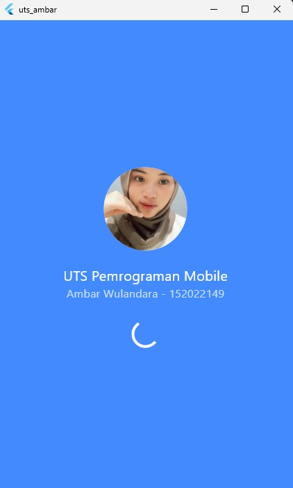
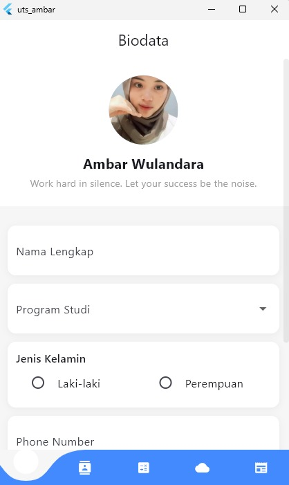
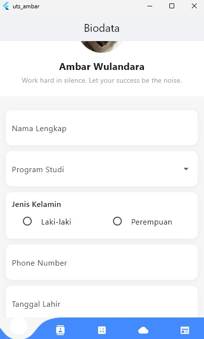
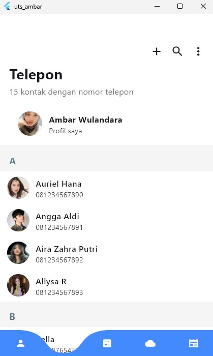
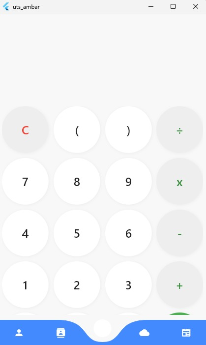
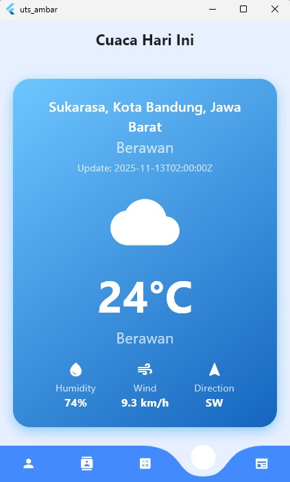
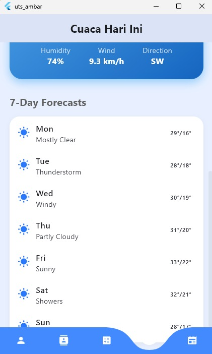
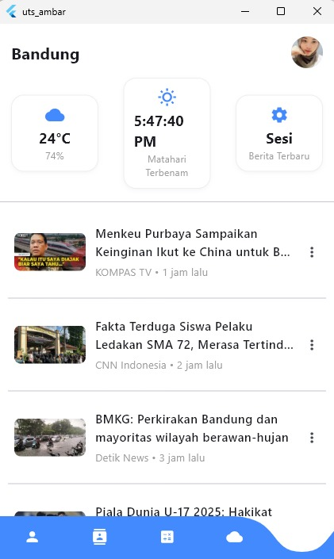

# UTS Pemrograman Mobile - Aplikasi Flutter 

---

## Deskripsi Aplikasi
Aplikasi ini dikembangkan untuk memenuhi tugas Ujian Tengah Semester (UTS) Pemrograman Mobile
Dibangun menggunakan Flutter framework, aplikasi ini menampilkan beberapa fitur utama yang menerapkan berbagai layout, widget, dan prinsip User Interface (UI) serta User Experience (UX)

Aplikasi memiliki 5 halaman utama dengan navigasi menggunakan Bottom Navigation Bar, yang menghubungkan beberapa halaman berikut:

| No | Halaman | Deskripsi |
|----|----------|-----------|
| 1  | Splash Screen| Tampilan pembuka selama 5 detik berisi judul aplikasi, foto, nama, dan NIM pengembang. |
| 2️  | Dashboard| Navigasi utama dengan menu: Biodata, Kontak, Kalkulator, Cuaca, dan Berita. |
| 3️  | Biodata| Halaman profil interaktif berisi foto, input teks, dropdown pilihan Prodi, radio button jenis kelamin, dan date picker untuk tanggal lahir. |
| 4️  | Kontak | Daftar 15 kontak statis dengan desain foto profil melingkar dan teks nama + nomor telepon. |
| 5  | Kalkulator| Kalkulator sederhana dengan fungsi: tambah, kurang, kali, bagi, dan tombol hapus (C). |
| 6️  | Cuaca | Menampilkan data cuaca realtime dari API BMKG, termasuk suhu, kelembapan, arah dan kecepatan angin, serta ikon kondisi cuaca yang menarik. |
| 7️  | Berita| Halaman daftar berita statis dengan layout kartu yang menarik dan terstruktur. |

---

## Screenshot Aplikasi

| Halaman | Tampilan |
|----------|-----------|
| Splash Screen |  |
| Dashboard |  |
| Biodata | |
| Kontak |  |
| Kalkulator |  |
| Cuaca | |
|Cuaca ||
| Berita |  |

> Semua desain dibuat dengan memperhatikan prinsip UI/UX yang bersih, modern, dan responsif.

---

## Teknologi yang Digunakan
- Framework:Flutter  
- Bahasa Pemrograman: Dart  
- Platform: Android  
- Library:  
  - `http` → untuk mengambil data dari API BMKG  
  - `intl` → untuk format tanggal  
  - `material` → widget standar Flutter  

---

## Cara Menjalankan Proyek
1. Clone repository ini:
   ```bash
   git clone https://github.com/ambarwulandara/UTS_Pemrograman_Mobile.git
